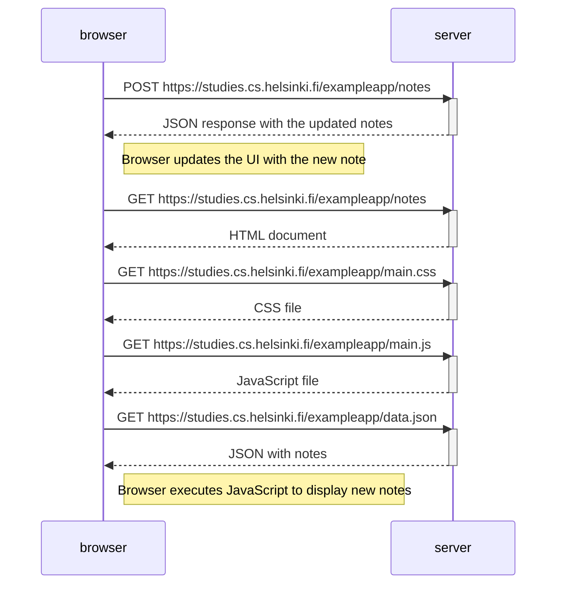

```mermaid
sequenceDiagram
    participant browser
    participant server

    browser->>server:  POST https://studies.cs.helsinki.fi/exampleapp/notes
    activate server
    server-->>browser:  JSON response with the updated notes
    deactivate server

    Note right of browser: Browser updates the UI with the new note

    browser->>server: GET https://studies.cs.helsinki.fi/exampleapp/notes
    activate server
    server-->>browser: HTML document
    deactivate server

    browser->>server: GET https://studies.cs.helsinki.fi/exampleapp/main.css
    activate server
    server-->>browser: CSS file
    deactivate server

    browser->>server: GET https://studies.cs.helsinki.fi/exampleapp/main.js
    activate server
    server-->>browser:  JavaScript file
    deactivate server

    browser->>server: GET https://studies.cs.helsinki.fi/exampleapp/data.json
    activate server
    server-->>browser: JSON with notes
    deactivate server

    Note right of browser:  Browser executes JavaScript to display new notes
```